  

 

  
  

## Sobre mim

Oi! Eu sou o **Vinicius**, tenho 25 anos e curso **Ciência de Dados no ICMC-USP**.
Gosto de trabalhar no encontro entre dados, inteligência artificial e engenharia de software. Uso este perfil para compartilhar o que estou aprendendo e mostrar os projetos que estou construindo.

## O que estou construindo

Meu projeto principal hoje é o **EDUKAIS**, uma plataforma de acompanhamento escolar construída no encontro entre **ciência de dados, inteligência artificial e desenvolvimento de software**. Ela organiza dados de frequência e desempenho para ajudar educadores a perceber mudanças importantes na trajetória dos alunos.
A plataforma já conta com uma inteligência artificial que aprende com o histórico acumulado e aprimora o acompanhamento ao longo dos anos.
No projeto, venho trabalhando com **Python, FastAPI, SQLite, React e TypeScript**, além de modelagem de dados, dashboards e regras transparentes de acompanhamento.

## Tecnologias que uso nos estudos e projetos

  
  
  
  
  
  
  
  
  
  
  
  
  

